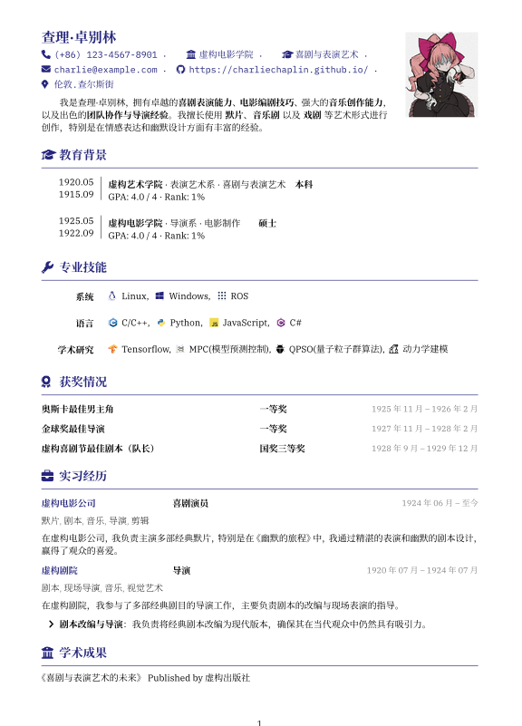

# 简洁优雅的 Typst 简历模板

这是一个使用 [Typst](https://typst.app/) 编写的简历模板，支持中英文，具有简洁优雅的设计风格，易于定制，适合程序员、设计师以及其他专业人士使用。



## ✨ 特点

- 清晰的分栏布局，便于组织各类信息
- 支持个人照片展示
- 内置多种 Font Awesome 图标
- 可自定义主题颜色
- 支持中英文排版
- 响应式设计，易于适配不同的内容长度

## 🚀 快速开始

### 1. 安装 Typst 

如果你还没有安装 Typst，请先从 [Typst 官网](https://typst.app/) 下载并安装。

### 2. 克隆仓库

```bash
git clone https://github.com/yourusername/typst-resume-template.git
cd typst-resume-template
```

### 3. 修改简历内容

打开 `resume.typ` 文件，按照模板修改你的个人信息、教育背景、工作经验等内容。

### 4. 编译简历

```bash
typst compile resume.typ
```

编译后会生成 `resume.pdf` 文件。

## 📝 定制指南

### 个人信息

修改 `resume.typ` 中的个人信息部分：

```typ
= 你的名字

#info(
  color: themeColor,
  (
    icon: faPhone,
    content: "你的电话"
  ),
  (
    icon: faBuildingColumns,
    content: "你的学校/公司",
  ),
  // 其他信息...
)
```

### 主题颜色

修改主题颜色非常简单：

```typ
#let themeColor = rgb(38, 38, 125)  // 更改为你喜欢的颜色
```

### 添加/修改照片

替换 `images/profile.png` 文件，或修改照片路径：

```typ
photograph: "path/to/your/photo.png",
photographWidth: 8em,  // 调整照片大小
```

### 添加更多图标

本模板已内置多种图标，如需添加更多图标：

1. 将 SVG 图标添加到 `icons/` 目录
2. 在 `resume.typ` 中添加图标引用：

```typ
#let faNewIcon = icon("icons/fa-newicon.svg")
```

## 📋 模板结构

- `template.typ`: 包含所有布局和样式定义
- `resume.typ`: 简历内容
- `icons/`: 存放所有图标
- `images/`: 存放个人照片等图片

## 📄 主要组件说明

### 侧边栏组件

```typ
#sidebar(withLine: true, sideWidth: 12%)[
  左侧内容
][
  右侧内容
]
```

### 技能展示

```typ
#sidebar2(withLine: false, sideWidth: 12%)[
  *类别标题*
][
  #图标1 技能1,
  #h(0.5em)
  #图标2 技能2
]
```

### 项目/经验条目

```typ
#item(
  [ *公司/组织* ],
  [ *职位* ],
  date[ 时间段 ]
)

#tech[ 技术1, 技术2, 技术3 ]
```

## 🔄 从已有例子修改

最简单的方式是以示例简历为基础进行修改：

1. 替换个人信息
2. 更新教育背景
3. 添加你的技能
4. 修改工作经验和项目
5. 更新获奖情况和学术成果

## 🎯 适用场景

- 程序员/工程师求职简历
- 设计师作品集前言
- 学术/研究人员简介
- 项目经理/产品经理个人简介

## 📜 许可

MIT 许可证 - 详情请见 [LICENSE](LICENSE) 文件

## 🙏 贡献

欢迎提交 Issues 和 Pull Requests 来改进这个模板！

---

如果这个项目对你有帮助，请考虑给它点个 ⭐️ Star！
